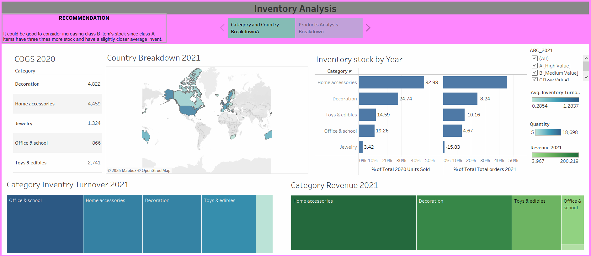

Perfect 👍 Thanks for sharing your **Inventory Analysis Tableau Dashboard** screenshot. Here’s a polished **README.md draft** for your GitHub repository:

---

# 📦 Inventory Analysis – Tableau Dashboard

📊 **[Click here to interact with the live visualization](https://public.tableau.com/views/InventryAnalysis/InventoryAnalysis?:language=en-US&:sid=&:redirect=auth&:display_count=n&:origin=viz_share_link)**

## 📌 Project Overview

This project uses **Tableau** to perform an **Inventory Analysis** across multiple product categories and regions. The dashboard helps businesses track **inventory stock levels, turnover, and revenue contribution** while identifying opportunities to optimize stock allocation.

## 🎯 Objectives

* Analyze **COGS (Cost of Goods Sold)** by product categories.
* Track **inventory stock performance over time**.
* Visualize **geographical sales distribution**.
* Compare **inventory turnover ratios** by category.
* Provide actionable **recommendations** for stock optimization.

## 🛠️ Tools & Technologies

* **Tableau** – data visualization & dashboard design
* **Inventory Dataset** – (COGS, revenue, quantity, category, country)

## 📊 Dashboard Features

1. **COGS by Category (2020)**

   * Breakdown of cost contributions by product category.

2. **Country Breakdown (2021)**

   * Interactive map showing global sales distribution.

3. **Inventory Stock by Year**

   * Side-by-side comparison of stock sold in 2020 vs 2021 across categories.

4. **Category Inventory Turnover (2021)**

   * Visualization of inventory efficiency per product category.

5. **Category Revenue (2021)**

   * Tree map highlighting revenue contribution per category.

6. **Recommendations Section**

   * Insights on stock optimization.

## ✅ Insights

* **Home accessories & decoration** categories dominate both sales and revenue.
* **Jewelry** has low turnover and negative growth, indicating possible overstocking or low demand.
* **Class B items** should be increased in stock to balance inventory distribution.
* Certain countries show stronger demand and can be targeted for optimized supply.

Would you also like me to **add a professional “Problem–Solution–Impact” section** (good for recruiters & portfolio) so your README reads more like a case study?
